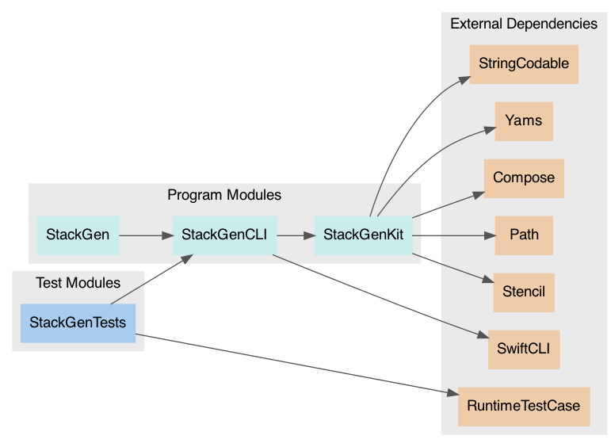
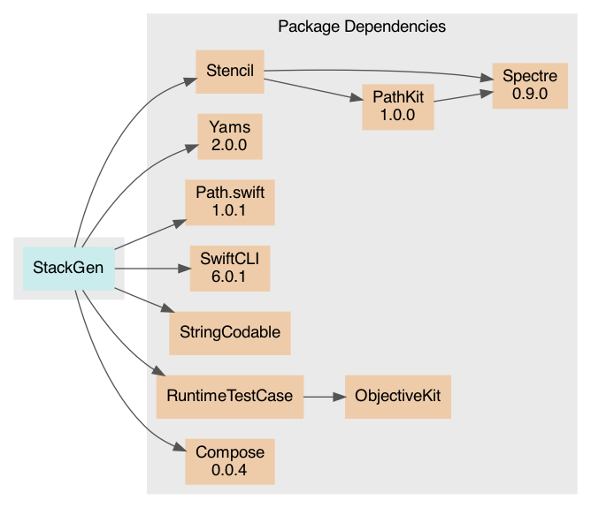

# Package: **StackGen**

## Products

List of products in this package:

| Product | Type | Targets |
| ------- | ---- | ------- |
| stackgen | Executable | StackGen |
| StackGenKit | Library (automatic) | StackGenKit |

_Libraries denoted 'automatic' can be both static or dynamic._

## Modules

### Program Modules

| Module | Type | Dependencies |
| ------ | ---- | ------------ |
| StackGen | Regular | StackGenCLI |
| StackGenCLI | Regular | StackGenKit, SwiftCLI |
| StackGenKit | Regular | Compose, Path, Stencil, StringCodable, Yams |

### Test Modules

| Module | Type | Dependencies |
| ------ | ---- | ------------ |
| StackGenTests | Test | RuntimeTestCase, StackGenCLI |

### Module Dependency Graph

## External Dependencies

### Direct Dependencies

| Package | Versions |
| ------- | -------- |
| [Compose](https://github.com/acecilia/Compose.git) | 0.0.4..<1.0.0 |
| [Path.swift](https://github.com/mxcl/Path.swift.git) | 1.0.1..<2.0.0 |
| [RuntimeTestCaseSwift](https://github.com/acecilia/RuntimeTestCaseSwift.git) | revision[e2c6ed3fc47279c85c5e5750a600e5e9ab86a0c9] |
| [Stencil](https://github.com/acecilia/Stencil.git) | revision[b43f9dd5151f92625c51c901193549e5d0030244] |
| [StringCodable](https://github.com/acecilia/StringCodable.git) | revision[b7d46cd32791753df1fe13b0b6ecdd9a19fbabcc] |
| [SwiftCLI](https://github.com/jakeheis/SwiftCLI.git) | 6.0.1..<7.0.0 |
| [Yams](https://github.com/jpsim/Yams.git) | 2.0.0..<3.0.0 |

### Resolved Dependencies

-   StackGen (unspecified)
    -   [Stencil (unspecified)](https://github.com/acecilia/Stencil.git)
        -   [PathKit (1.0.0)](https://github.com/kylef/PathKit.git)
            -   [Spectre (0.9.0)](https://github.com/kylef/Spectre.git)
        -   [Spectre (0.9.0)](https://github.com/kylef/Spectre.git)
    -   [Yams (2.0.0)](https://github.com/jpsim/Yams.git)
    -   [Path.swift (1.0.1)](https://github.com/mxcl/Path.swift.git)
    -   [SwiftCLI (6.0.1)](https://github.com/jakeheis/SwiftCLI.git)
    -   [StringCodable (unspecified)](https://github.com/acecilia/StringCodable.git)
    -   [RuntimeTestCase (unspecified)](https://github.com/acecilia/RuntimeTestCaseSwift.git)
        -   [ObjectiveKit (unspecified)](https://github.com/acecilia/ObjectiveKit)
    -   [Compose (0.0.4)](https://github.com/acecilia/Compose.git)

### Package Dependency Graph

## Requirements

### Minimum Required Versions

| Platform | Version |
| -------- | ------- |
| macOS | 10.14 |

This file was generated by [SourceDocs](https://github.com/eneko/SourceDocs)